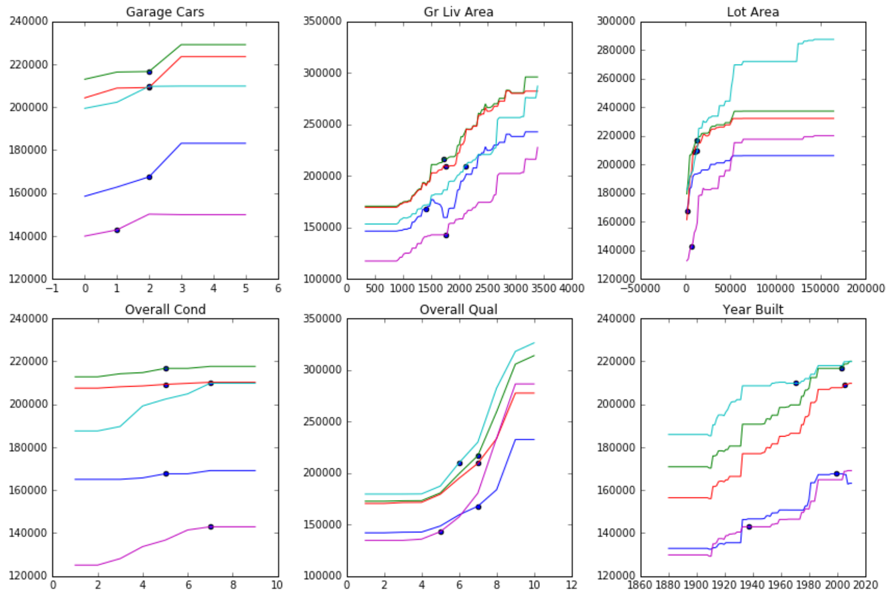

## ML Insights

Welcome to ML-Insights!

This package contains two main sets of tools:

- SplineCalib: Spline-based Probability Calibration
- ModelXRay: Model Interpretability

## Probability Calibration

For probability calibration, use the SplineCalib class.  Detailed documentation is available here:
[https://ml-insights.readthedocs.io](https://ml-insights.readthedocs.io)

Find more detailed examples here:
[https://github.com/numeristical/introspective/tree/master/examples](https://github.com/numeristical/introspective/tree/master/examples)

## Model Interpretation

For understanding black-box models, the main entry point is the `ModelXRay` class.  Instantiate it with the model and data.  The data can be what the model was trained with, but intended to be used for out of bag or test data to see how the model performs when one feature is changed, holding everything else constant.

    >>> import ml_insights as mli
    >>> xray = mli.ModelXRay(model, data.sample(500))
    >>> xray.feature_dependence_plots()

Find more detailed examples here:
[https://github.com/numeristical/introspective/tree/master/examples](https://github.com/numeristical/introspective/tree/master/examples)

## Other Documentation

[https://ml-insights.readthedocs.io](https://ml-insights.readthedocs.io)

Disclaimer
==========

We have tested this tool to the best of our ability, but understand that it may have bugs.  It was developed on Python 3.  Use at your own risk, but feel free to report any bugs to our github. <https://github.com/numeristical/introspective>

Installation
=============

    $ pip install ml_insights

Source
======

Find the latest version on github: https://github.com/numeristical/introspective

Feel free to fork and contribute!

License
=======

Free software: `MIT license <LICENSE>`_

Developed By
============

- Brian Lucena
- Ramesh Sampath

References
==========

Lucena, B. 2018. Spline-Based Probability Calibration. https://arxiv.org/abs/1809.07751

Alex Goldstein, Adam Kapelner, Justin Bleich, and Emil Pitkin. 2014. Peeking Inside the Black Box: Visualizing Statistical Learning With Plots of Individual Conditional Expectation. Journal of Computational and Graphical Statistics (March 2014)
